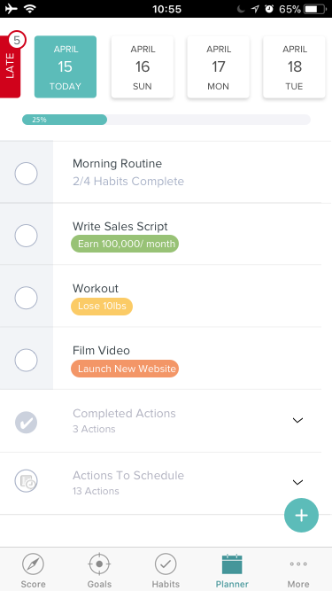

# Date Button Slider

We have a user interface component on our task planner that allows you to choose
beween late tasks and tasks on a particular day.

We'd like this component looking like the mockup above.

We'll have additional projects styling other parts of this page, but this is
the first step.

There are two components defined. The main one is `date-button-slider` and it
uses another component `square-button`.  Feel free to change either one of these
components.  The `square-button` component isn't used anywhere else in our app
so if you want to remove it or replace it with something else go ahead.

The late button currently uses `square-button` but if it's easier to work with
this button on its on go ahead.

One feature that isn't in the existing version is the idea of a badge on the
late button.  I've seen designs with the badge on other days, but Zander didn't
include it here.  If it's easy to have the same style of badge on any of the
buttons that would be great. It should be optional, if no badge value is
assigned it shouldn't show up.
